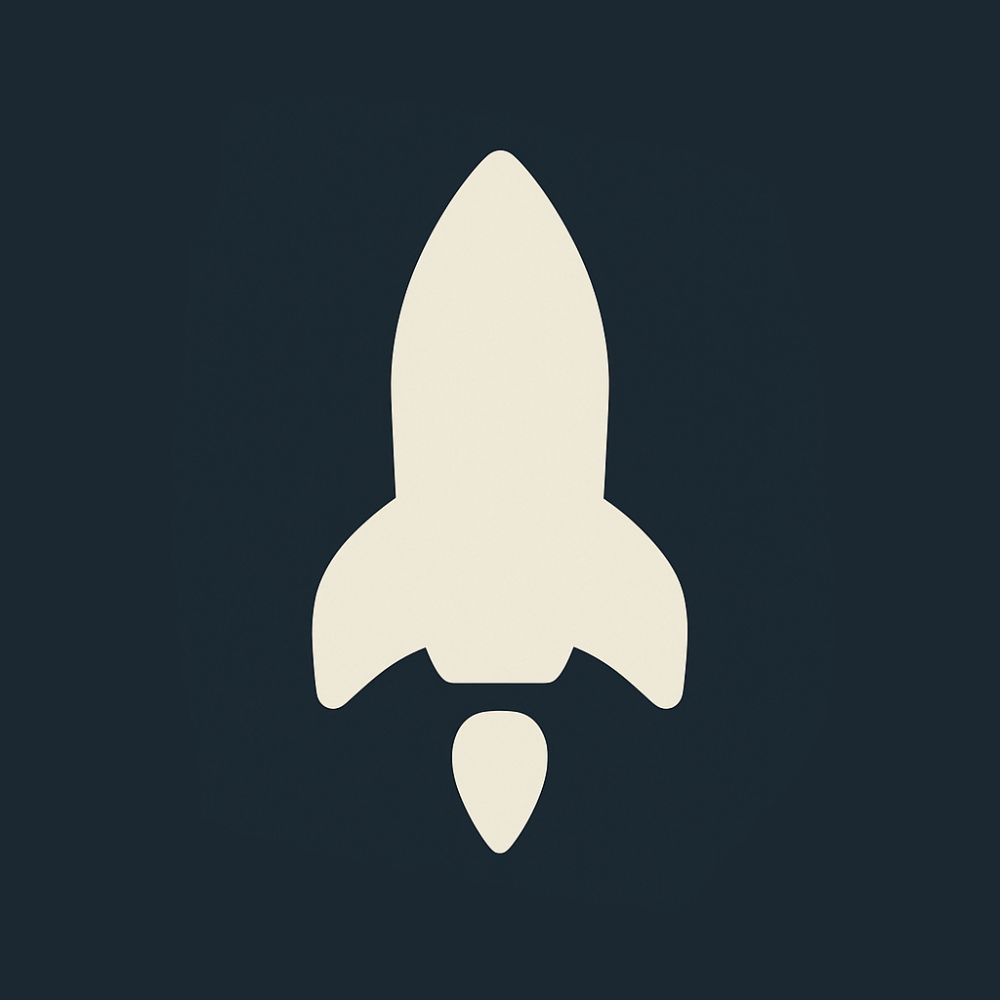

# CoreLaunch

CoreLaunch is a digital wellbeing app designed to help you develop healthier relationships with your devices by promoting mindful app usage, focus sessions, and screen time management.

## Features

### 🚀 Mindful App Launcher
- Custom app launcher that helps you make intentional choices about the apps you use
- Breathing Room feature that adds a brief pause before launching distracting apps
- Thoughtful reflection prompts that encourage mindful usage decisions

### ⏱️ Focus Mode
- Create distraction-free work sessions by blocking specific apps
- Schedule focus sessions in advance
- Receive progress notifications as you complete your sessions
- Track your focus history and build streaks

### 📊 Usage Statistics
- Monitor your device usage patterns with detailed statistics
- Set daily usage limits and weekly reduction goals
- View your progress through beautiful, intuitive visualizations
- Identify your most time-consuming apps

### 🏆 Achievement System
- Earn achievements as you develop healthier usage habits
- Build streaks for consistent progress
- Multiple achievement categories: Daily Goals, Weekly Reduction, Focus Sessions, and more
- Visual rewards that celebrate your digital wellbeing journey

### 🎨 Customizable Experience
- Multiple themes to personalize your experience
- Adjustable text sizes and font options
- Motivational messages to inspire mindful choices
- Minimalist design to reduce digital clutter

## Why CoreLaunch?

In today's hyperconnected world, our devices often command more of our attention than we intend to give them. CoreLaunch was created to help restore balance by:

1. **Increasing Awareness**: Visualize your actual usage patterns
2. **Encouraging Intention**: Make conscious choices about when and why you use apps
3. **Building Better Habits**: Create sustainable, healthy digital routines
4. **Celebrating Progress**: Recognize and reward positive changes

CoreLaunch doesn't focus on restriction — instead, it empowers you to make mindful choices about your digital life.

## Getting Started

### Prerequisites
- iOS 15.6 or later

### Installation
1. Download CoreLaunch from the App Store
2. Set up your preferred apps, usage goals, and focus sessions
3. Allow notifications for focus updates and achievement celebrations

## How to Use

### Home Screen
The home screen displays your available apps, current time, and motivational messages. Simply tap an app to launch it, with optional Breathing Room pauses for distracting apps.

### Focus Mode
1. Tap the timer icon
2. Select apps to block during your focus session
3. Set the duration
4. Start your session and stay focused!

### Usage Stats
Track your progress in the Usage Stats section, where you can:
- View daily and weekly usage
- Set and monitor reduction goals
- Identify usage patterns
- Celebrate achievements

### Settings
Customize your experience through the Settings menu:
- Toggle 24-hour time
- Enable/disable date display
- Choose from multiple themes
- Adjust text size and font
- Configure Breathing Room settings

## Privacy

CoreLaunch is committed to your privacy:
- All usage data is stored locally on your device
- No data is shared with external servers
- No advertising or tracking

## License

This project is licensed under the MIT License - see the [LICENSE](LICENSE) file for details.
